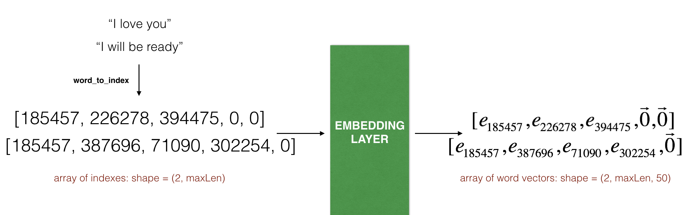

## 情感分析

我们都有过网上购物的经验，一般在确认收货的时候网站都会让我们为商品留下评论并且打星星，一般是1星到5星，星级的多少也代表了我们这次购物的满意程度。那我们能不能根据评论的内容来推断客户本次购物的满意程度呢？人当然是可以的，但是今天我们要让算法来做类似的事情。

## Emojify

现在，有许多脚本可以在我们的内容中自动插入代表语义的表情符号，比如下面这句英文，"Congratulations on the promotion! Lets get coffee and talk. Love you!" 输入相应的脚本就可以将其转换为： "Congratulations on the promotion! 👍 Lets get coffee and talk. ☕️ Love you! ❤️"。但是这些脚本仅仅是根据关键字的记忆以及匹配来完成的，无法真正做到语义的理解，而且泛化能力不强，如果某个关键字不处于脚本内的关键字列表内的话就无法匹配。所以本项目将使用RNN+LSTM+Word embedding来完成，当然作为对比，我们还会使用一种简单的解决方案来作为对照。


```python
import numpy as np
from emo_utils import *
import emoji
import matplotlib.pyplot as plt

%matplotlib inline
```

## 1 -简单的方案--softmax regression

### 1.1 - 提取数据集

我们的数据集由127个训练样本和56个测试样本组成（样本有点儿少哈，但是这样才能体现出Word embedding的威力）。

其中Y是范围为0--4的整数，代表了每个句子对应的表情符号。

下图给了部分的样本，通过观察可以大致了解样本的情况。


```python
X_train, Y_train = read_csv('train_emoji.csv')
X_test, Y_test = read_csv('test.csv')
```


```python
maxLen = len(max(X_train, key=len).split())
```

下面做一下简单的数据可视化，index代表想要查看的样本的index，下面的句子将会打印出样本句子与其对应的表情符号（其中表情符号用到了emoji库，该库提供了丰富的表情符号，感兴趣的可以自己试试[emoji](https://pypi.org/project/emoji/)


```python
index = 9
print(X_train[index], label_to_emoji(Y_train[index]))
```

    I want to go play ⚾


### 1.2 - 模型

下面我们就来实现下图中的这个模型


该模型的输入为句子的字符串，我们解析出每个字符串的单词，然后将其用词向量表示（比如50维度的词向量），然后将所有的词向量取平均作为模型的输入，这样，不管句子的长短，都可以正确输入模型。然后通过一个5个隐藏单元的softmax来进行分类输出，我们将使用argmax来判断哪个表情的可能性最大

为了匹配输出的维度，我们要将样本中的标签以one-hot vector的形式表现出来


```python
Y_oh_train = convert_to_one_hot(Y_train, C = 5)
Y_oh_test = convert_to_one_hot(Y_test, C = 5)
```


```python
index = 50
print(Y_train[index], "is converted into one hot", Y_oh_train[index])
```

    0 is converted into one hot [1. 0. 0. 0. 0.]


### 1.3 - 模型搭建以及训练

从上图中可以看出来，我们需要将输入的句子以词向量的形式表示，然后再对他们进行平均。普通情况下，我们使用vocabulary（词汇表）然后再加上one-hot representation来表示，这种表示方式的一大缺点就是，它把每个词都孤立起来，这样使得算法对相关词的泛化能力不强，比如模型知道orange juice，但是很有可能无法将其泛化为apple juice（如果训练集中没有apple juice的话）。由于两个词语的one-hot vector的乘积为0，所以其本身无法表示两个词语的任何关系。所以我们这里采用预训练的Word embedding，Word embedding是经过庞大的数据集训练（10亿甚至100亿级别）的词向量，其能够很好地表达单词之间的相关信息。

本项目中，我们直接采用Glove Word vector，其采用[Glove](https://nlp.stanford.edu/projects/glove/)算法在大量数据集上进行训练，每个词向量的维度为50，下面我们加载embedding matrix及其对应的转换方法。


```python
import zipfile
from os.path import isfile

file_name = 'glove.6B.50d.txt'
zip_file_name = 'glove.6B.50d.zip'

##解压缩
if not isfile(file_name):
    zip_file = zipfile.ZipFile(zip_file_name)

    for names in zip_file.namelist():
        zip_file.extract(names,'./')

    zip_file.close()

## 读取文件
word_to_index, index_to_word, word_to_vec_map = read_glove_vecs(file_name)
```

上面函数返回：

- `word_to_index`:将Word映射到index的字典(400,001 个单词, index的有效范围是 0 to 400,000)
- `index_to_word`: 将index映射为对应词典中相应的Word的字典
- `word_to_vec_map`: 字典，将Word映射为对应的GloVe vector


```python
# 可以尝试一下，这个词典还是挺全的
word = "riki"
index = 289846
print("the index of", word, "in the vocabulary is", word_to_index[word])
print("the", str(index) + "th word in the vocabulary is", index_to_word[index])
print (word_to_vec_map[word])
```

    the index of riki in the vocabulary is 308731
    the 289846th word in the vocabulary is potatos
    [ 0.028124 -0.63486  -0.27306   0.59     -0.70151  -0.6989   -0.022798
     -0.036259  0.13135  -0.37172   0.19088   0.6423   -0.18758  -0.032136
      0.41346  -0.29416   0.49238  -0.32997   0.31169   1.3649   -0.80761
      0.59873  -0.37682   0.71334   1.4189    0.86403   2.1224   -0.4706
     -0.51496   0.5896   -0.43853   0.5058    0.77305   0.18307  -1.4219
      1.4845    0.085943 -0.18945   0.29573   0.27643   0.76693   0.94809
     -0.37852  -0.45716   0.36598   0.61302   0.55279  -0.38215   0.28966
      0.050976]


接下来要完成一个函数，这个函数负责将字符串转换为模型有效的输入，也就是将Word映射为Glove的表示方式


```python
def sentence_to_avg(sentence, word_to_vec_map):
    # 词向量里面都是小写，所以这里转换为小写
    words = sentence.lower().split()

    avg = np.zeros(50)
    
    for w in words:
        avg += word_to_vec_map[w]
    avg = avg/len(words)
    
    return avg
```


```python
avg = sentence_to_avg("Morrocan couscous is my favorite dish", word_to_vec_map)
print("avg = ", avg)
```

    avg =  [-0.008005    0.56370833 -0.50427333  0.258865    0.55131103  0.03104983
     -0.21013718  0.16893933 -0.09590267  0.141784   -0.15708967  0.18525867
      0.6495785   0.38371117  0.21102167  0.11301667  0.02613967  0.26037767
      0.05820667 -0.01578167 -0.12078833 -0.02471267  0.4128455   0.5152061
      0.38756167 -0.898661   -0.535145    0.33501167  0.68806933 -0.2156265
      1.797155    0.10476933 -0.36775333  0.750785    0.10282583  0.348925
     -0.27262833  0.66768    -0.10706167 -0.283635    0.59580117  0.28747333
     -0.3366635   0.23393817  0.34349183  0.178405    0.1166155  -0.076433
      0.1445417   0.09808667]


#### Model

有了输入之后就可以执行forward propagation和backward propagation对模型进行训练了，model函数完成下面的功能，由于只有一个softmax比较简单，这里我决定手动来执行前向和后向传播


```python
def model(X, Y, word_to_vec_map, learning_rate = 0.01, num_iterations = 400):
    np.random.seed(1)

    m = Y.shape[0]                          # 样本数量
    n_y = 5                                 # 类别数量
    n_h = 50                                # 输入维度，也是Glove的维度
    
    # 使用Xavier来初始化W
    W = np.random.randn(n_y, n_h) / np.sqrt(n_h)
    b = np.zeros((n_y,))

    Y_oh = convert_to_one_hot(Y, C = n_y) 
    
    # 循环
    for t in range(num_iterations):                       
        for i in range(m):
            
            # 获取输入句子的平均Glove
            avg = sentence_to_avg(X[i], word_to_vec_map)

            # 前向传播
            z = np.dot(W, avg.reshape(-1, 1)) + b.reshape(-1, 1)
            a = softmax(z.reshape(-1))

            # 损失函数：cross entropy
            cost = -np.sum(Y_oh[i]*np.log(a))
            
            # 反向传播
            dz = a - Y_oh[i]
            dW = np.dot(dz.reshape(n_y,1), avg.reshape(1, n_h))
            db = dz

            # 更新梯度
            W = W - learning_rate * dW
            b = b - learning_rate * db
        
        if t % 100 == 0:
            print("Epoch: " + str(t) + " --- cost = " + str(cost))
            pred = predict(X, Y, W, b, word_to_vec_map)

    return pred, W, b
```


```python
print(X_train.shape)
print(Y_train.shape)
print(np.eye(5)[Y_train.reshape(-1)].shape)
print(X_train[0])
print(type(X_train))
Y = np.asarray([5,0,0,5, 4, 4, 4, 6, 6, 4, 1, 1, 5, 6, 6, 3, 6, 3, 4, 4])
print(Y.shape)

X = np.asarray(['I am going to the bar tonight', 'I love you', 'miss you my dear',
 'Lets go party and drinks','Congrats on the new job','Congratulations',
 'I am so happy for you', 'Why are you feeling bad', 'What is wrong with you',
 'You totally deserve this prize', 'Let us go play football',
 'Are you down for football this afternoon', 'Work hard play harder',
 'It is suprising how people can be dumb sometimes',
 'I am very disappointed','It is the best day in my life',
 'I think I will end up alone','My life is so boring','Good job',
 'Great so awesome'])

print(X.shape)
print(np.eye(5)[Y_train.reshape(-1)].shape)
print(type(X_train))

```

    (132,)
    (132,)
    (132, 5)
    never talk to me again
    <class 'numpy.ndarray'>
    (20,)
    (20,)
    (132, 5)
    <class 'numpy.ndarray'>


```python
pred, W, b = model(X_train, Y_train, word_to_vec_map)
print(pred)
```

    Epoch: 0 --- cost = 1.9520498812810076
    Accuracy: 0.3484848484848485
    Epoch: 100 --- cost = 0.07971818726014794
    Accuracy: 0.9318181818181818
    Epoch: 200 --- cost = 0.04456369243681402
    Accuracy: 0.9545454545454546
    Epoch: 300 --- cost = 0.03432267378786059
    Accuracy: 0.9696969696969697
    [[3.]
     [2.]
     [3.]
     [0.]
     [4.]
     [0.]
     [3.]
     [2.]
     [3.]
     [1.]
     [3.]
     [3.]
     [1.]
     [3.]
     [2.]
     [3.]
     [2.]
     [3.]
     [1.]
     [2.]
     [3.]
     [0.]
     [2.]
     [2.]
     [2.]
     [1.]
     [4.]
     [3.]
     [3.]
     [4.]
     [0.]
     [3.]
     [4.]
     [2.]
     [0.]
     [3.]
     [2.]
     [2.]
     [3.]
     [4.]
     [2.]
     [2.]
     [0.]
     [2.]
     [3.]
     [0.]
     [3.]
     [2.]
     [4.]
     [3.]
     [0.]
     [3.]
     [3.]
     [3.]
     [4.]
     [2.]
     [1.]
     [1.]
     [1.]
     [2.]
     [3.]
     [1.]
     [0.]
     [0.]
     [0.]
     [3.]
     [4.]
     [4.]
     [2.]
     [2.]
     [1.]
     [2.]
     [0.]
     [3.]
     [2.]
     [2.]
     [0.]
     [3.]
     [3.]
     [1.]
     [2.]
     [1.]
     [2.]
     [2.]
     [4.]
     [3.]
     [3.]
     [2.]
     [4.]
     [0.]
     [0.]
     [3.]
     [3.]
     [3.]
     [3.]
     [2.]
     [0.]
     [1.]
     [2.]
     [3.]
     [0.]
     [2.]
     [2.]
     [2.]
     [3.]
     [2.]
     [2.]
     [2.]
     [4.]
     [1.]
     [1.]
     [3.]
     [3.]
     [4.]
     [1.]
     [2.]
     [1.]
     [1.]
     [3.]
     [1.]
     [0.]
     [4.]
     [0.]
     [3.]
     [3.]
     [4.]
     [4.]
     [1.]
     [4.]
     [3.]
     [0.]
     [2.]]


其实我们可以看到，即使使用如何简单的模型，如此少量的样本，训练出来的模型的分数还是很高的

### 1.4 - 下面来看看模型在测试集上面的表现


```python
print("Training set:")
pred_train = predict(X_train, Y_train, W, b, word_to_vec_map)
print('Test set:')
pred_test = predict(X_test, Y_test, W, b, word_to_vec_map)
```

    Training set:
    Accuracy: 0.977272727273
    Test set:
    Accuracy: 0.857142857143


我们的模型有5个分类，如果是乱猜的话正确率会有20%，在如此少量的训练样本上这个表现是相当不错的。在训练集里面，"*I love you*" 这个样本的label是 ❤️，而"adore"这个单词是没有出现在训练集中的。所以我们可以来看看输入"*I adore you*."，模型依然可以正确判断吗？（验证模型的泛化能力）


```python
X_my_sentences = np.array(["it is good", "i adore you", "funny lol", "lets play with a ball", "food is ready", "not feeling happy"])
Y_my_labels = np.array([[0], [0], [2], [1], [4],[3]])

pred = predict(X_my_sentences, Y_my_labels , W, b, word_to_vec_map)
print_predictions(X_my_sentences, pred)
```

    Accuracy: 0.6666666666666666
    
    it is good 😄
    i adore you ❤️
    funny lol 😄
    lets play with a ball ⚾
    food is ready 🍴
    not feeling happy 😄


哈哈，我们可以看到，算法成功地将"I adore you."预测正确，因为在Glove的表示方法中love和adore是很相似的，所以算法将love泛化到了adore。

但是请注意，最后一个测试语“not feeling happy”被误分类为happy的笑脸了，这就是我们这个简单模型的缺陷了，因为该模型仅仅捕捉了整句话的平均信息而忽略的词语的前后顺序，所以其无法理解类似“not happy”这种句子。

### 单算法的总结

1，使用了少量的样本训练出了不错的效果，这都归功于glove的词向量表达方式

2，但是这种简答的模型在关乎顺序的句子中是表现很差的，因为它仅仅将各个词语平均，提取平均信息，无法提取句子间的顺序信息。

## 2 - RNN with LSTM（keras实现）

接下来我们利用RNN（其中time step采用LSTM来实现）来构建一个新的模型，这个模型可以估计到单词间的顺序信息，并且我们将继续采用Glove作为词向量的表现方式。我们将采用keras来快速搭建RNN模型。


```python
import numpy as np
np.random.seed(0)
from keras.models import Model
from keras.layers import Dense, Input, Dropout, LSTM, Activation
from keras.layers.embeddings import Embedding
from keras.preprocessing import sequence
from keras.initializers import glorot_uniform
np.random.seed(1)
```

    /home/riki/anaconda3/envs/py3/lib/python3.6/site-packages/h5py/__init__.py:34: FutureWarning: Conversion of the second argument of issubdtype from `float` to `np.floating` is deprecated. In future, it will be treated as `np.float64 == np.dtype(float).type`.
      from ._conv import register_converters as _register_converters
    Using TensorFlow backend.


### 2.1 - 模型

下面就是我们将使用的模型，接下来我会对模型进行简单地解释


### 2.2 mini-batch注意事项（keras中的RNN）

我们希望以mini-batch的形式来训练RNN，这样更高效。然而，绝大部分的深度学习框架都要求同一mini-batch的所有的序列都拥有相同的长度。这样的话才能实现向量化运算。因为如果mini-batch中多个样本的句子长度不一致的话，将会导致不能同时运算。

这种问题的一般解决办法就是padding，有点儿像CNN中的那种padding，首先指定一个最长样本长度，然后将所有长度不足最长长度的样本都padding到最长长度，具体的padding方法就是加入0词向量。如果样本的长度超过最长长度那就去掉超出部分。一个选择最长长度的方法就是取训练集中长度最长的句子的长度。

### 2.3 - The Embedding layer

在keras中，embedding matrix表示为一个“layer”，它将输入的正整数（对应Word的index）映射为固定大小的向量(词向量)。embedding layer可以被一个预训练的embedding vector初始化。在本项目中，我们将使用Glove-50来初始化这个layer，但是我们并不打算进一步更新/训练这个layer，因为我们的训练集太小了，更新embedding vector反而会造成更差的效果。keras的embedding layer提供了控制是否在训练过程中更新embedding vector的选项



其中embedding layer输入的最大的整数（Word index）应该不大于字典的大小，embedding layer的输出维度为 (batch size, max input length, dimension of word vectors).

所以第一步应该是将输入的句子转换为index的数组，然后对样本进行zero-padding以对齐最大长度。

下面的函数实现了将输入的batch samples转换为batch index。


```python
def sentences_to_indices(X, word_to_index, max_len):
    """
        将输入的句子转换为index的形式
    
        参数：
            X：输入的句子的数组，大小为(m,1)
            word_to_index：Word到index的映射
            max_len:对齐的最大长度
        返回：
            index形式的样本，大小为(m, max_len)
    """
    
    m = X.shape[0]
    
    X_indices = np.zeros((len(X), max_len))
    
    for i in range(m):
        
        sentence_words = X[i].lower().split()
        
        j = 0
        
        for w in sentence_words:

            X_indices[i, j] = word_to_index[w]
            j = j + 1
    
    return X_indices
```


```python
def pretrained_embedding_layer(word_to_vec_map, word_to_index):
    
    vocab_len = len(word_to_index)+1                  # 这是keras要求的+1
    #print (vocab_len)
    emb_dim = word_to_vec_map["cucumber"].shape[0]      # Word embedding的长度
    
    emb_matrix = np.zeros((vocab_len, emb_dim))
    
    for word, index in word_to_index.items():
        emb_matrix[index, :] = word_to_vec_map[word]

    embedding_layer = Embedding(vocab_len, emb_dim, trainable = False)

    embedding_layer.build((None,))
    
    embedding_layer.set_weights([emb_matrix])
    
    return embedding_layer
```


```python
embedding_layer = pretrained_embedding_layer(word_to_vec_map, word_to_index)
print("weights[0][1][3] =", embedding_layer.get_weights()[0][1][3])
```

    weights[0][1][3] = -0.3403


## 2.3 搭建模型

下图中的模型就是我们要搭建的RNN模型，可以看到我们直接将embedding layer输出作为LSTM网络的输入，并且只在最后一个time step输出，输出同样为softmax，输出的维度为(m, 5)。并且为了更多的模型复杂度，如下的网络采用deep RNN进行了堆叠，并且在各层之间加入了dropout来减小过拟合的风险。


```python
def Emojify_V2(input_shape, word_to_vec_map, word_to_index):
    # 定义模型的输入层，该输入的大小为(m, max_len)，输入的内容是经过了index转换的样本数据
    sentence_indices = Input(shape=input_shape, dtype='int32')
    
    embedding_layer = pretrained_embedding_layer(word_to_vec_map, word_to_index)
    
    # 将embedding layer链如模型
    embeddings = embedding_layer(sentence_indices)   
    
    # 接下来搭建第一层LSTM，这一层的隐藏单元大小为128，而且注意return_sequences参数表明现在是要返回整个sequence的输出（True）还是只返回最后一个
    # time step的输出（False）。这里我们的第一层LSTM是要返回整个序列的输出，所以为True。
    X = LSTM(units=128, return_sequences=True)(embeddings)
    X = Dropout(0.5)(X)
    # 搭建第二层的LSTM，注意这里我们只需要返回最后一个timestep的输出
    X = LSTM(units=128)(X)
    X = Dropout(0.5)(X)
    X = Dense(5)(X)
    #X = softmax(X)
    X = Activation('softmax')(X)
    model = Model(inputs=sentence_indices, outputs=X)
    
    return model
```

记下来我们运行上面的函数来搭建模型。由于数据集中的样本长度均小于10，所以我们的max_len就选择10.

然后我们打印模型的summary来看看，总共参数为20223927，但是可训练的参数仅仅为223887，这是因为我们的embedding layer就占用了20000050个参数。


```python
model = Emojify_V2((maxLen,), word_to_vec_map, word_to_index)
model.summary()
```

    _________________________________________________________________
    Layer (type)                 Output Shape              Param #   
    =================================================================
    input_12 (InputLayer)        (None, 10)                0         
    _________________________________________________________________
    embedding_13 (Embedding)     (None, 10, 50)            20000050  
    _________________________________________________________________
    lstm_15 (LSTM)               (None, 10, 128)           91648     
    _________________________________________________________________
    dropout_15 (Dropout)         (None, 10, 128)           0         
    _________________________________________________________________
    lstm_16 (LSTM)               (None, 128)               131584    
    _________________________________________________________________
    dropout_16 (Dropout)         (None, 128)               0         
    _________________________________________________________________
    dense_12 (Dense)             (None, 5)                 645       
    _________________________________________________________________
    activation_12 (Activation)   (None, 5)                 0         
    =================================================================
    Total params: 20,223,927
    Trainable params: 223,877
    Non-trainable params: 20,000,050
    _________________________________________________________________


接下来，我们将要compile我们的模型，因为输出为softmax所以loss选择categorical_crossentropy。然后optimizer采用模型的Adam配置，衡量标准采用accuracy，代表预测的准确率。


```python
model.compile(loss='categorical_crossentropy', optimizer='adam', metrics=['accuracy'])
```


```python
X_train_indices = sentences_to_indices(X_train, word_to_index, maxLen)
Y_train_oh = convert_to_one_hot(Y_train, C = 5)
```

下面训练的时候我大概用了94个epoch


```python
model.fit(X_train_indices, Y_train_oh, epochs = 50, batch_size = 32, shuffle=True)
##validation_split=0.2, 
##initial_epoch=0
```

    Epoch 1/50
    132/132 [==============================] - 2s 15ms/step - loss: 1.5884 - acc: 0.2803
    Epoch 2/50
    132/132 [==============================] - 0s 713us/step - loss: 1.5250 - acc: 0.2955
    Epoch 3/50
    132/132 [==============================] - 0s 759us/step - loss: 1.4938 - acc: 0.3333
    Epoch 4/50
    132/132 [==============================] - 0s 1ms/step - loss: 1.4549 - acc: 0.3333
    Epoch 5/50
    132/132 [==============================] - 0s 1ms/step - loss: 1.3635 - acc: 0.3561
    Epoch 6/50
    132/132 [==============================] - 0s 1ms/step - loss: 1.2468 - acc: 0.4470
    Epoch 7/50
    132/132 [==============================] - 0s 913us/step - loss: 1.1242 - acc: 0.5606
    Epoch 8/50
    132/132 [==============================] - 0s 861us/step - loss: 1.0031 - acc: 0.6212
    Epoch 9/50
    132/132 [==============================] - 0s 755us/step - loss: 0.9289 - acc: 0.6515
    Epoch 10/50
    132/132 [==============================] - 0s 773us/step - loss: 0.8107 - acc: 0.7121
    Epoch 11/50
    132/132 [==============================] - 0s 796us/step - loss: 0.7050 - acc: 0.7576
    Epoch 12/50
    132/132 [==============================] - 0s 805us/step - loss: 0.7044 - acc: 0.7197
    Epoch 13/50
    132/132 [==============================] - 0s 778us/step - loss: 0.5743 - acc: 0.7803
    Epoch 14/50
    132/132 [==============================] - 0s 751us/step - loss: 0.6373 - acc: 0.8106
    Epoch 15/50
    132/132 [==============================] - 0s 809us/step - loss: 0.5212 - acc: 0.8333
    Epoch 16/50
    132/132 [==============================] - 0s 944us/step - loss: 0.3922 - acc: 0.8864
    Epoch 17/50
    132/132 [==============================] - 0s 865us/step - loss: 0.2963 - acc: 0.9318
    Epoch 18/50
    132/132 [==============================] - 0s 751us/step - loss: 0.3606 - acc: 0.8864
    Epoch 19/50
    132/132 [==============================] - 0s 749us/step - loss: 0.2566 - acc: 0.8864
    Epoch 20/50
    132/132 [==============================] - 0s 796us/step - loss: 0.2273 - acc: 0.9470
    Epoch 21/50
    132/132 [==============================] - 0s 832us/step - loss: 0.2383 - acc: 0.9242
    Epoch 22/50
    132/132 [==============================] - 0s 833us/step - loss: 0.3818 - acc: 0.8561
    Epoch 23/50
    132/132 [==============================] - 0s 946us/step - loss: 0.2569 - acc: 0.9242
    Epoch 24/50
    132/132 [==============================] - 0s 874us/step - loss: 0.1739 - acc: 0.9394
    Epoch 25/50
    132/132 [==============================] - 0s 780us/step - loss: 0.1507 - acc: 0.9621
    Epoch 26/50
    132/132 [==============================] - 0s 831us/step - loss: 0.1411 - acc: 0.9697
    Epoch 27/50
    132/132 [==============================] - 0s 854us/step - loss: 0.1459 - acc: 0.9545
    Epoch 28/50
    132/132 [==============================] - 0s 805us/step - loss: 0.1221 - acc: 0.9545
    Epoch 29/50
    132/132 [==============================] - 0s 843us/step - loss: 0.0743 - acc: 0.9848
    Epoch 30/50
    132/132 [==============================] - 0s 810us/step - loss: 0.0668 - acc: 0.9773
    Epoch 31/50
    132/132 [==============================] - 0s 816us/step - loss: 0.0787 - acc: 0.9697
    Epoch 32/50
    132/132 [==============================] - 0s 785us/step - loss: 0.0627 - acc: 0.9773
    Epoch 33/50
    132/132 [==============================] - 0s 832us/step - loss: 0.0682 - acc: 0.9773
    Epoch 34/50
    132/132 [==============================] - 0s 870us/step - loss: 0.0779 - acc: 0.9697
    Epoch 35/50
    132/132 [==============================] - 0s 793us/step - loss: 0.1150 - acc: 0.9697
    Epoch 36/50
    132/132 [==============================] - 0s 808us/step - loss: 0.0624 - acc: 0.9848
    Epoch 37/50
    132/132 [==============================] - 0s 773us/step - loss: 0.0370 - acc: 0.9848
    Epoch 38/50
    132/132 [==============================] - 0s 789us/step - loss: 0.0155 - acc: 1.0000
    Epoch 39/50
    132/132 [==============================] - 0s 855us/step - loss: 0.0293 - acc: 0.9848
    Epoch 40/50
    132/132 [==============================] - 0s 1ms/step - loss: 0.0271 - acc: 0.9924
    Epoch 41/50
    132/132 [==============================] - 0s 789us/step - loss: 0.0212 - acc: 1.0000
    Epoch 42/50
    132/132 [==============================] - 0s 836us/step - loss: 0.0142 - acc: 0.9924
    Epoch 43/50
    132/132 [==============================] - 0s 757us/step - loss: 0.0217 - acc: 1.0000
    Epoch 44/50
    132/132 [==============================] - 0s 830us/step - loss: 0.0200 - acc: 0.9924
    Epoch 45/50
    132/132 [==============================] - 0s 822us/step - loss: 0.0147 - acc: 1.0000
    Epoch 46/50
    132/132 [==============================] - 0s 853us/step - loss: 0.0156 - acc: 0.9924
    Epoch 47/50
    132/132 [==============================] - 0s 822us/step - loss: 0.0116 - acc: 1.0000
    Epoch 48/50
    132/132 [==============================] - 0s 747us/step - loss: 0.0042 - acc: 1.0000
    Epoch 49/50
    132/132 [==============================] - 0s 742us/step - loss: 0.0129 - acc: 1.0000
    Epoch 50/50
    132/132 [==============================] - 0s 801us/step - loss: 0.0166 - acc: 0.9924


    <keras.callbacks.History at 0x7f1adbab86a0>


由于本项目的样本是在太少，所以我在fit的时候并没有划分验证集用于查看验证集的准确率。总共才100多个样本，验证集分配多了，模型肯定过拟合，验证集分配少了，那验证的结果又不具有代表性，所以这里就不纠结于调参的过程了。这个项目的主要目的还是为了学习RNN还有Word embedding等概念。


```python
X_test_indices = sentences_to_indices(X_test, word_to_index, max_len = maxLen)
Y_test_oh = convert_to_one_hot(Y_test, C = 5)
loss, acc = model.evaluate(X_test_indices, Y_test_oh)
print()
print("Test accuracy = ", acc)
```

    56/56 [==============================] - 1s 12ms/step
    
    Test accuracy =  0.8392857142857143


```python
# 下面查看划分错误的句子
C = 5
y_test_oh = np.eye(C)[Y_test.reshape(-1)]
X_test_indices = sentences_to_indices(X_test, word_to_index, maxLen)
pred = model.predict(X_test_indices)
for i in range(len(X_test)):
    x = X_test_indices
    num = np.argmax(pred[i])
    if(num != Y_test[i]):
        print('Expected emoji:'+ label_to_emoji(Y_test[i]) + ' prediction: '+ X_test[i] + label_to_emoji(num).strip())
```

    Expected emoji:😄 prediction: she got me a nice present	❤️
    Expected emoji:😞 prediction: work is hard	😄
    Expected emoji:😞 prediction: This girl is messing with me	❤️
    Expected emoji:😞 prediction: work is horrible	😄
    Expected emoji:😄 prediction: you brighten my day	❤️
    Expected emoji:😞 prediction: she is a bully	😄
    Expected emoji:😞 prediction: My life is so boring	❤️
    Expected emoji:😞 prediction: I do not want to joke	❤️
    Expected emoji:😞 prediction: go away	⚾


初步原因分析还是训练集的样本太少，虽然Word embedding搭建的模型泛化能力好，但是如果类似的样本一次都没见过的话，那么也是无法进行泛化的。

下面尝试一下自己想输入的句子


```python
x_test = np.array(['not feeling happy'])
X_test_indices = sentences_to_indices(x_test, word_to_index, maxLen)
print(x_test[0] +' '+  label_to_emoji(np.argmax(model.predict(X_test_indices))))
```

    not feeling happy 😞


之前我们简单的模型无法分辨出not feeling happy,但是现在我们的模型可以了。但是当前模型不能分辨not happy，是因为负面情绪的样本太少了。如果训练集更庞大的话那么该模型肯定会表现更出色。
